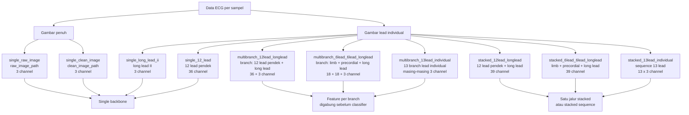

# TeluxMMU ECG Classification

Pipeline klasifikasi penyakit ECG berbasis PyTorch. Repository ini sekarang diarahkan ke struktur modular: notebook hanya untuk preprocessing/eksplorasi, sedangkan eksperimen model dijalankan melalui CLI di `src.runner`.

## Setup

Install dari komputer baru cukup lewat CLI:

```bash
git clone <repo-url>
cd TeluxMMU
uv sync --all-extras
```

Jika memakai notebook:

```bash
uv run python -m ipykernel install --user --name teluxmmu-research --display-name "teluxmmu-research"
```

Pilih kernel `teluxmmu-research`.

## Struktur Utama

```text
configs/      Konfigurasi eksperimen YAML
notebooks/    Notebook preprocessing yang masih dipertahankan
scripts/      Entrypoint preprocessing, training, evaluasi, inference, ranking
src/          Pipeline modular training/evaluation/inference
summary/      Catatan audit dan planning
data/         Dataset lokal, dianggap read-only
runs/         Output eksperimen, metrics, checkpoint, logs
```

Notebook model lama di root sudah dihapus agar alur eksperimen tidak bercabang. Notebook preprocessing dipindahkan ke:

```text
notebooks/preprocessing.ipynb
```

Jalankan notebook preprocessing dari CLI:

```bash
bash scripts/run_preprocessing_notebook.sh
```

Output default:

```text
notebooks/preprocessing_executed.ipynb
```

Script final yang dipakai:

```text
run_preprocessing_notebook.sh  preprocessing notebook
train_mobilenet.sh            training semua skema MobileNet
train_efficientnet.sh         training semua skema EfficientNet
train_resnet.sh               training semua skema ResNet
train_densenet.sh             training semua skema DenseNet
eval_only.sh                  evaluasi checkpoint
inference_only.sh             inference checkpoint
rank_runs.sh                  ranking semua run
```

File `_full_training_model.sh` adalah helper internal untuk empat script training.

## Model Dan Flag

Default model per keluarga:

```text
MobileNet      mobilenet_v2
EfficientNet   efficientnet_v2_s
ResNet         resnet50
DenseNet       densenet201
```

Model yang bisa dipilih lewat `--model-name`:

```text
mobilenet_v2
mobilenet_v3_large
mobilenet_v3_small
efficientnet_b0
efficientnet_b1
efficientnet_b2
efficientnet_v2_s
resnet18
resnet34
resnet50
resnet101
densenet121
densenet169
densenet201
```

Flag utama:

```text
--model-name
--input-scheme
--epochs
--batch-size
--learning-rate
--min-learning-rate
--weight-decay
--num-workers
--max-samples
--max-samples-percent
--pretrained / --no-pretrained
--early-stopping / --no-early-stopping
--multibranch-backbone-sharing shared|independent
--multibranch-use-branch-heads / --no-multibranch-use-branch-heads
--run-name
--output-dir
--foreground
--reset
```

Flag dash seperti `--batch-size` dan format lama underscore seperti `--batch_size` sama-sama didukung.

Smoke test 5% data:

```bash
bash scripts/train_resnet.sh \
  --foreground \
  --reset \
  --epochs 1 \
  --batch-size 16 \
  --max-samples-percent 5 \
  --no-pretrained
```

Hasil smoke test RTX 3060 12GB, `epochs=1`, `max-samples-percent=5`, mixed precision:

```text
mobilenet_v2        batch 16 lolos semua 10 skema
efficientnet_v2_s   batch 16 gagal pada 13-lead individual, batch 8 lolos semua 10 skema
resnet50            batch 16 lolos semua 10 skema
densenet201         batch 16 gagal pada 13-lead individual, batch 8 lolos smoke; default wrapper memakai batch 4
```

Karena target reproducible untuk semua default model dan semua skema, default `configs/default.yaml` memakai:

```yaml
training:
  batch_size: 8
```

## Dataset Policy

Folder `data/` tidak boleh diubah oleh pipeline training. Split, manifest, label mapping, cache, metrics, dan checkpoint disimpan di dalam folder run:

```text
runs/YYYYMMDD_HHMMSS_run_name/
```

Mapping label aktual:

```json
{
  "ECG_Normal": "Normal",
  "ECG_Abnormal": "Abnormal",
  "ECG_HistoryMI": "HistoryMI",
  "ECG_MI": "MI"
}
```

## Data Discovery

Validasi cepat tanpa training:

```bash
uv run python -m src.runner \
  --config configs/default.yaml \
  --run-name discovery_check \
  --dry-run-discovery
```

Output discovery tersimpan di:

```text
runs/*_discovery_check/artifacts/data_discovery.json
runs/*_discovery_check/artifacts/data_discovery.md
runs/*_discovery_check/artifacts/manifest.csv
runs/*_discovery_check/artifacts/label_mapping.json
```

Split train/validation/test memakai stratified group split berdasarkan hash representasi input. Ini mencegah exact duplicate image atau lead masuk ke split berbeda. Audit split disimpan di:

```text
runs/*/artifacts/splits/split_audit.json
```

## Training dan Evaluation

Training utama dijalankan melalui wrapper keluarga model:

```bash
bash scripts/train_mobilenet.sh --reset --epochs 50 --batch-size 8
bash scripts/train_efficientnet.sh --reset --epochs 50 --batch-size 8
bash scripts/train_resnet.sh --reset --epochs 50 --batch-size 8
bash scripts/train_densenet.sh --reset --epochs 50
```

Progress training terbaru selalu ditulis ulang ke file root:

```text
training.log
```

File ini cocok dipantau dengan:

```bash
tail -f training.log
```

Salinan permanen per run juga disimpan di:

```text
runs/YYYYMMDD_HHMMSS_run_name/logs/training.log
```

Smoke test kecil:

```bash
bash scripts/train_resnet.sh \
  --foreground \
  --reset \
  --epochs 1 \
  --batch-size 8 \
  --max-samples-percent 5
```

Default training tidak memakai early stopping:

```yaml
early_stopping: false
```

Jika ingin mengaktifkan early stopping untuk run tertentu:

```bash
bash scripts/train_resnet.sh \
  --early-stopping \
  --run-name exp_with_early_stopping
```

LR scheduler default memakai cosine scheduler dengan minimum learning rate:

```yaml
scheduler: cosine
learning_rate: 0.0001
min_learning_rate: 0.000001
```

Checkpoint resume disimpan berkala setiap 10 epoch:

```yaml
checkpoint_interval: 10
```

File resume utama:

```text
runs/<run>/checkpoints/latest.pt
runs/<run>/artifacts/training_progress.json
```

Jika training crash, jalankan command yang sama dengan `--output-dir` folder run lama, atau untuk full training cukup jalankan ulang wrapper yang sama; script akan memakai state file dan melanjutkan run yang belum selesai.

Override dari CLI:

```bash
bash scripts/train_resnet.sh \
  --learning-rate 0.0001 \
  --min-learning-rate 0.000001 \
  --run-name exp_cosine_lr
```

Override interval checkpoint:

```bash
bash scripts/train_resnet.sh \
  --checkpoint-interval 10 \
  --run-name exp_resume_ready
```

## Eval Only

Evaluasi checkpoint tanpa training:

```bash
bash scripts/eval_only.sh \
  --model-name resnet50 \
  --input-scheme single_clean_image \
  --checkpoint-path runs/<run>/checkpoints/best.pt \
  --run-name eval_resnet50_best
```

## Inference Only

Inference gambar/folder dari checkpoint:

```bash
bash scripts/inference_only.sh \
  --model-name mobilenet_v2 \
  --input-scheme single_clean_image \
  --checkpoint-path runs/<run>/checkpoints/best.pt \
  --inference-dir path/to/images \
  --run-name infer_mobilenet_v2
```

## Full Training Semua Skema

Semua wrapper full training menjalankan 10 skema input secara serial, satu per satu:

```text
single_raw_image
single_clean_image
single_12_lead
single_long_lead_ii
multibranch_12lead_longlead
multibranch_6lead_6lead_longlead
multibranch_13lead_individual
stacked_12lead_longlead
stacked_6lead_6lead_longlead
stacked_13lead_individual
```

Visualisasi perbedaan skema:



Wrapper per keluarga model:

```bash
bash scripts/train_mobilenet.sh
bash scripts/train_efficientnet.sh
bash scripts/train_resnet.sh
bash scripts/train_densenet.sh
```

Script berjalan background by default dan tidak menulis output ke terminal. Tambahkan `--foreground` untuk smoke test atau debug.

Contoh full training batch seragam:

```bash
bash scripts/train_resnet.sh \
  --reset \
  --epochs 50 \
  --batch-size 16
```

```bash
bash scripts/train_efficientnet.sh \
  --reset \
  --epochs 50 \
  --batch-size 8
```

```bash
bash scripts/train_densenet.sh \
  --reset \
  --epochs 50
```

Contoh ganti varian:

```bash
bash scripts/train_resnet.sh --model-name resnet34 --epochs 50 --batch-size 8
bash scripts/train_mobilenet.sh --model-name mobilenet_v3_large --epochs 50 --batch-size 16
bash scripts/train_efficientnet.sh --model-name efficientnet_b0 --epochs 50 --batch-size 16
bash scripts/train_densenet.sh --model-name densenet201 --epochs 50
```

Default keluarga model:

```text
MobileNet     mobilenet_v2        ~2.2M params
EfficientNet  efficientnet_v2_s   ~20.2M params
ResNet        resnet50            ~23.5M params
DenseNet      densenet201         ~18.1M params, memory_efficient=True
```

Varian yang tersedia:

```text
ResNet        resnet18, resnet34, resnet50, resnet101
MobileNet     mobilenet_v2, mobilenet_v3_large, mobilenet_v3_small
EfficientNet  efficientnet_b0, efficientnet_b1, efficientnet_b2, efficientnet_v2_s
DenseNet      densenet121, densenet169, densenet201
```

Smoke test 5% data, 1 epoch, `--no-pretrained`, RTX 3060 12GB:

```text
batch 16 lolos semua skema: mobilenet_v2, resnet50
batch 16 gagal skema 13 lead: efficientnet_v2_s, densenet201
batch 8 lolos semua skema: mobilenet_v2, efficientnet_v2_s, resnet50
densenet201 default wrapper: batch 4
```

Default training per keluarga model:

```bash
bash scripts/train_resnet.sh --reset --epochs 50 --batch-size 8
bash scripts/train_mobilenet.sh --reset --epochs 50 --batch-size 8
bash scripts/train_efficientnet.sh --reset --epochs 50 --batch-size 8
bash scripts/train_densenet.sh --reset --epochs 50
```

Catatan: `train_densenet.sh` default memakai batch size 4. Jika ingin memaksa batch lain, tetap bisa:

```bash
bash scripts/train_densenet.sh --reset --epochs 50 --batch-size 8
```

Catatan skema stacked:

```text
stacked_12lead_longlead      13 lead channel-stack dengan order grid/generic 01-13
stacked_6lead_6lead_longlead 13 lead channel-stack dengan order anatomical: limb, precordial, long
stacked_13lead_individual    13 lead sequence tensor (13, 3, H, W) dengan shared backbone
```

Perbedaan konsep input:

```text
single       satu input masuk ke satu backbone lalu classifier
stacked      beberapa lead digabung sebagai satu tensor/sequence sebelum classifier
multibranch  setiap kelompok lead tetap menjadi branch terpisah, feature tiap branch digabung lewat late fusion
```

Secara default `multibranch` memakai shared backbone agar MobileNetV2, EfficientNetV2-S, dan ResNet50 tetap realistis di GPU 12GB. Konsep multibranch tetap dipertahankan karena setiap branch masih punya input adapter dan branch head sendiri sebelum fusion. Untuk eksperimen ablation yang ingin backbone benar-benar terpisah per branch:

```bash
bash scripts/train_resnet.sh \
  --input-scheme multibranch_13lead_individual \
  --multibranch-backbone-sharing independent
```

Konfigurasi multibranch default:

```yaml
model:
  multibranch_backbone_sharing: shared
  multibranch_shared_in_channels: 3
  multibranch_branch_projection_dim: 512
  multibranch_use_branch_heads: true
```

Setiap skema membuat folder run sendiri di `runs/`. File root `training.log` menunjukkan skema yang sedang berjalan saat ini; untuk log permanen tiap experiment, buka:

```text
runs/<run_name>/logs/training.log
```

State full training disimpan di folder run root masing-masing, misalnya:

```text
runs/full_training_all_state.csv
runs/resnet/full_training_all_state.csv
runs/efficientnet/full_training_all_state.csv
runs/densenet/full_training_all_state.csv
```

Untuk memulai batch full training baru dari awal, gunakan `--reset`.

```bash
bash scripts/train_mobilenet.sh --reset --epochs 50 --batch-size 8
```

## Output Run

Setiap run membuat:

```text
runs/YYYYMMDD_HHMMSS_run_name/
├── config_resolved.yaml
├── run_summary.md
├── logs/
├── artifacts/
├── metrics/
├── plots/
└── checkpoints/
```

## Ranking Semua Run

Untuk membaca seluruh folder/subfolder `runs/` dan membuat ranking global serta ranking per model:

```bash
bash scripts/rank_runs.sh
```

Output laporan:

```text
summary/run_rankings/global_rank.csv
summary/run_rankings/global_rank_by_macro_f1.csv
summary/run_rankings/best_per_model.csv
summary/run_rankings/rank_per_model_accuracy.csv
summary/run_rankings/rank_per_model_macro_f1.csv
summary/run_rankings/RUN_RANKING_SUMMARY.md
```

Jika nanti ingin scan folder lain:

```bash
RUNS_ROOT=runs OUTPUT_DIR=summary/run_rankings bash scripts/rank_runs.sh
```
