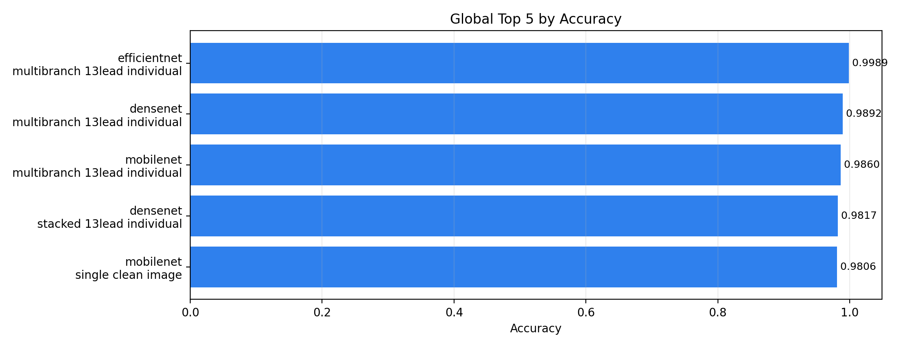
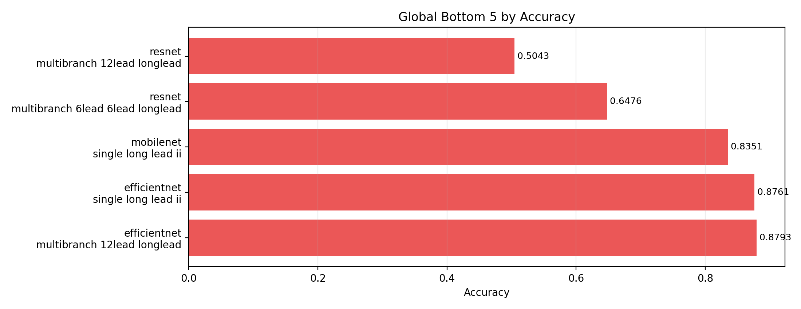
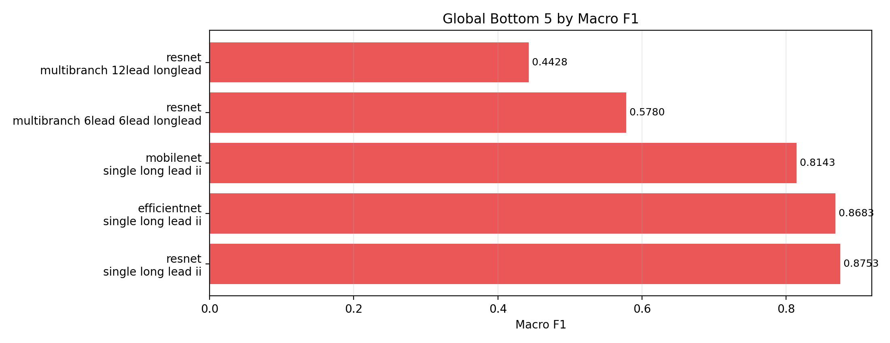
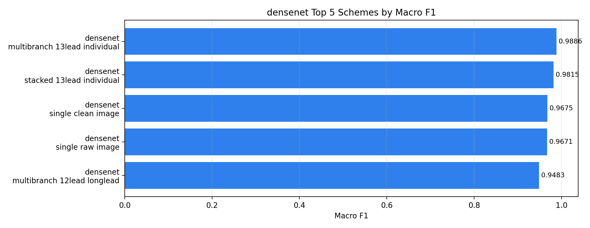
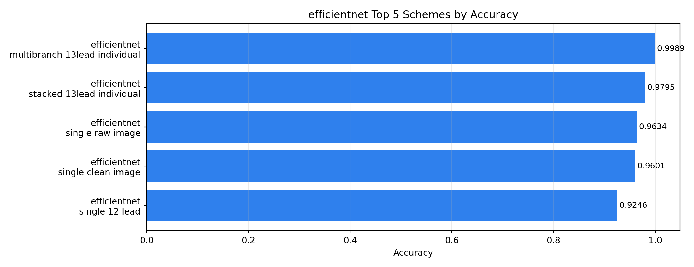
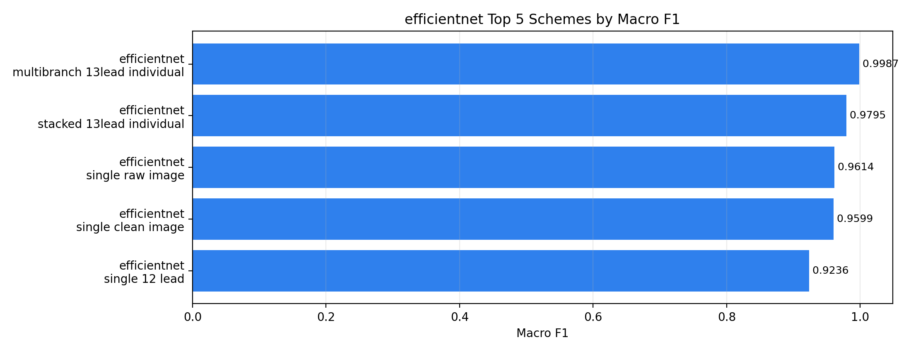
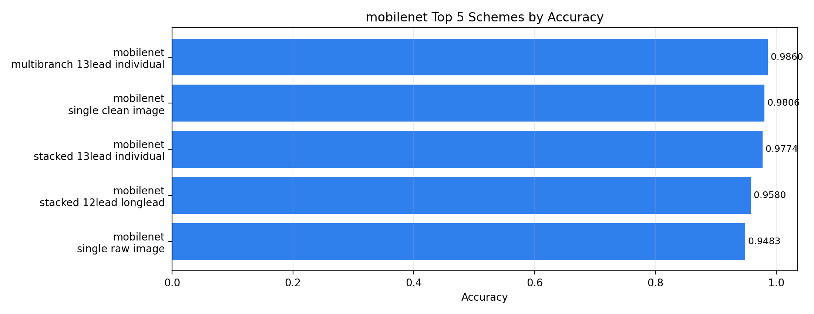
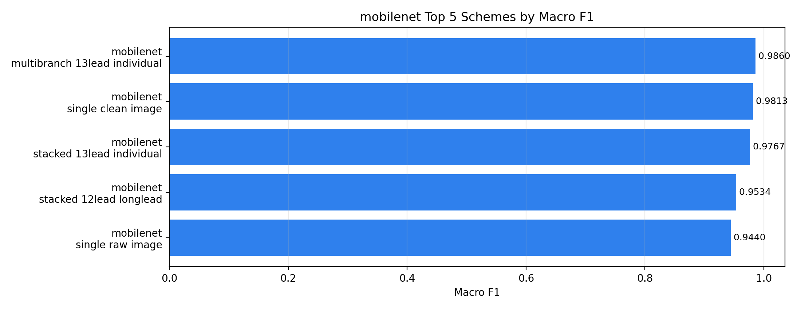
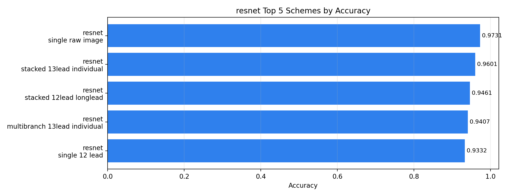
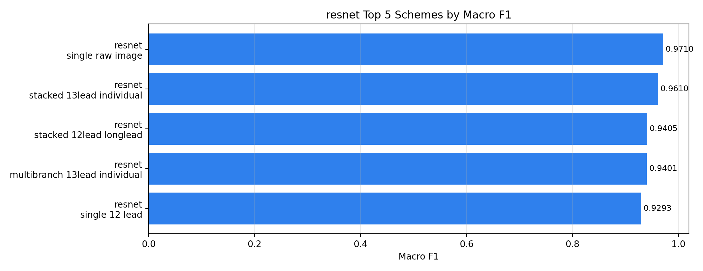

# Run Ranking Summary

Generated at: 2026-06-26T17:33:25
Total completed metric files: 40

## Global Rank by Accuracy

| global_rank_accuracy | model_name | input_scheme | accuracy | macro_f1 | run_dir |
| --- | --- | --- | --- | --- | --- |
| 1 | efficientnet_v2_s | multibranch_13lead_individual | 0.9989 | 0.9987 | runs/all_data_eval/efficientnet/20260622_033048_efficientnet_v2_s_multibranch_13lead_individual |
| 2 | densenet201 | multibranch_13lead_individual | 0.9892 | 0.9886 | runs/all_data_eval/densenet/20260622_232928_densenet201_multibranch_13lead_individual |
| 3 | mobilenet_v2 | multibranch_13lead_individual | 0.9860 | 0.9860 | runs/all_data_eval/mobilenet/20260621_210532_mobilenet_v2_multibranch_13lead_individual |
| 4 | densenet201 | stacked_13lead_individual | 0.9817 | 0.9815 | runs/all_data_eval/densenet/20260626_055149_densenet201_stacked_13lead_individual |
| 5 | mobilenet_v2 | single_clean_image | 0.9806 | 0.9813 | runs/all_data_eval/mobilenet/20260621_184656_mobilenet_v2_single_clean_image |
| 6 | efficientnet_v2_s | stacked_13lead_individual | 0.9795 | 0.9795 | runs/all_data_eval/efficientnet/20260622_061523_efficientnet_v2_s_stacked_13lead_individual |
| 7 | mobilenet_v2 | stacked_13lead_individual | 0.9774 | 0.9767 | runs/all_data_eval/mobilenet/20260621_231004_mobilenet_v2_stacked_13lead_individual |
| 8 | resnet50 | single_raw_image | 0.9731 | 0.9710 | runs/all_data_eval/resnet/20260622_013326_resnet50_single_raw_image |
| 9 | densenet201 | single_raw_image | 0.9698 | 0.9671 | runs/all_data_eval/densenet/20260622_192903_densenet201_single_raw_image |
| 10 | densenet201 | single_clean_image | 0.9677 | 0.9675 | runs/all_data_eval/densenet/20260622_195751_densenet201_single_clean_image |
| 11 | efficientnet_v2_s | single_raw_image | 0.9634 | 0.9614 | runs/all_data_eval/efficientnet/20260622_001937_efficientnet_v2_s_single_raw_image |
| 12 | resnet50 | stacked_13lead_individual | 0.9601 | 0.9610 | runs/all_data_eval/resnet/20260622_060902_resnet50_stacked_13lead_individual |
| 13 | efficientnet_v2_s | single_clean_image | 0.9601 | 0.9599 | runs/all_data_eval/efficientnet/20260622_004141_efficientnet_v2_s_single_clean_image |
| 14 | mobilenet_v2 | stacked_12lead_longlead | 0.9580 | 0.9534 | runs/all_data_eval/mobilenet/20260621_215443_mobilenet_v2_stacked_12lead_longlead |
| 15 | mobilenet_v2 | single_raw_image | 0.9483 | 0.9440 | runs/all_data_eval/mobilenet/20260621_183351_mobilenet_v2_single_raw_image |
| 16 | densenet201 | multibranch_12lead_longlead | 0.9472 | 0.9483 | runs/all_data_eval/densenet/20260622_213446_densenet201_multibranch_12lead_longlead |
| 17 | resnet50 | stacked_12lead_longlead | 0.9461 | 0.9405 | runs/all_data_eval/resnet/20260622_044727_resnet50_stacked_12lead_longlead |
| 18 | resnet50 | multibranch_13lead_individual | 0.9407 | 0.9401 | runs/all_data_eval/resnet/20260622_044722_resnet50_multibranch_13lead_individual |
| 19 | densenet201 | multibranch_6lead_6lead_longlead | 0.9375 | 0.9359 | runs/all_data_eval/densenet/20260622_222833_densenet201_multibranch_6lead_6lead_longlead |
| 20 | mobilenet_v2 | stacked_6lead_6lead_longlead | 0.9364 | 0.9364 | runs/all_data_eval/mobilenet/20260621_223239_mobilenet_v2_stacked_6lead_6lead_longlead |

## Global Rank by Macro F1

| global_rank_macro_f1 | model_name | input_scheme | macro_f1 | accuracy | run_dir |
| --- | --- | --- | --- | --- | --- |
| 1 | efficientnet_v2_s | multibranch_13lead_individual | 0.9987 | 0.9989 | runs/all_data_eval/efficientnet/20260622_033048_efficientnet_v2_s_multibranch_13lead_individual |
| 2 | densenet201 | multibranch_13lead_individual | 0.9886 | 0.9892 | runs/all_data_eval/densenet/20260622_232928_densenet201_multibranch_13lead_individual |
| 3 | mobilenet_v2 | multibranch_13lead_individual | 0.9860 | 0.9860 | runs/all_data_eval/mobilenet/20260621_210532_mobilenet_v2_multibranch_13lead_individual |
| 4 | densenet201 | stacked_13lead_individual | 0.9815 | 0.9817 | runs/all_data_eval/densenet/20260626_055149_densenet201_stacked_13lead_individual |
| 5 | mobilenet_v2 | single_clean_image | 0.9813 | 0.9806 | runs/all_data_eval/mobilenet/20260621_184656_mobilenet_v2_single_clean_image |
| 6 | efficientnet_v2_s | stacked_13lead_individual | 0.9795 | 0.9795 | runs/all_data_eval/efficientnet/20260622_061523_efficientnet_v2_s_stacked_13lead_individual |
| 7 | mobilenet_v2 | stacked_13lead_individual | 0.9767 | 0.9774 | runs/all_data_eval/mobilenet/20260621_231004_mobilenet_v2_stacked_13lead_individual |
| 8 | resnet50 | single_raw_image | 0.9710 | 0.9731 | runs/all_data_eval/resnet/20260622_013326_resnet50_single_raw_image |
| 9 | densenet201 | single_clean_image | 0.9675 | 0.9677 | runs/all_data_eval/densenet/20260622_195751_densenet201_single_clean_image |
| 10 | densenet201 | single_raw_image | 0.9671 | 0.9698 | runs/all_data_eval/densenet/20260622_192903_densenet201_single_raw_image |
| 11 | efficientnet_v2_s | single_raw_image | 0.9614 | 0.9634 | runs/all_data_eval/efficientnet/20260622_001937_efficientnet_v2_s_single_raw_image |
| 12 | resnet50 | stacked_13lead_individual | 0.9610 | 0.9601 | runs/all_data_eval/resnet/20260622_060902_resnet50_stacked_13lead_individual |
| 13 | efficientnet_v2_s | single_clean_image | 0.9599 | 0.9601 | runs/all_data_eval/efficientnet/20260622_004141_efficientnet_v2_s_single_clean_image |
| 14 | mobilenet_v2 | stacked_12lead_longlead | 0.9534 | 0.9580 | runs/all_data_eval/mobilenet/20260621_215443_mobilenet_v2_stacked_12lead_longlead |
| 15 | densenet201 | multibranch_12lead_longlead | 0.9483 | 0.9472 | runs/all_data_eval/densenet/20260622_213446_densenet201_multibranch_12lead_longlead |
| 16 | mobilenet_v2 | single_raw_image | 0.9440 | 0.9483 | runs/all_data_eval/mobilenet/20260621_183351_mobilenet_v2_single_raw_image |
| 17 | resnet50 | stacked_12lead_longlead | 0.9405 | 0.9461 | runs/all_data_eval/resnet/20260622_044727_resnet50_stacked_12lead_longlead |
| 18 | resnet50 | multibranch_13lead_individual | 0.9401 | 0.9407 | runs/all_data_eval/resnet/20260622_044722_resnet50_multibranch_13lead_individual |
| 19 | mobilenet_v2 | stacked_6lead_6lead_longlead | 0.9364 | 0.9364 | runs/all_data_eval/mobilenet/20260621_223239_mobilenet_v2_stacked_6lead_6lead_longlead |
| 20 | densenet201 | multibranch_6lead_6lead_longlead | 0.9359 | 0.9375 | runs/all_data_eval/densenet/20260622_222833_densenet201_multibranch_6lead_6lead_longlead |

## Best per Model

| model_name | num_runs | best_accuracy | best_accuracy_input_scheme | best_macro_f1 | best_macro_f1_input_scheme |
| --- | --- | --- | --- | --- | --- |
| densenet201 | 10 | 0.9892 | multibranch_13lead_individual | 0.9886 | multibranch_13lead_individual |
| efficientnet_v2_s | 10 | 0.9989 | multibranch_13lead_individual | 0.9987 | multibranch_13lead_individual |
| mobilenet_v2 | 10 | 0.9860 | multibranch_13lead_individual | 0.9860 | multibranch_13lead_individual |
| resnet50 | 10 | 0.9731 | single_raw_image | 0.9710 | single_raw_image |

## Ranking Plots

### Global Top 5 Accuracy

### Global Bottom 5 Accuracy

### Global Top 5 Macro F1

### Global Bottom 5 Macro F1

### Densenet Top 5 Accuracy

### Densenet Top 5 Macro F1

### Efficientnet Top 5 Accuracy

### Efficientnet Top 5 Macro F1

### Mobilenet Top 5 Accuracy

### Mobilenet Top 5 Macro F1

### Resnet Top 5 Accuracy

### Resnet Top 5 Macro F1

## Output Files

- `global_rank.csv`
- `global_rank_by_macro_f1.csv`
- `best_per_model.csv`
- `rank_per_model_accuracy.csv`
- `rank_per_model_macro_f1.csv`
- `plots/global_top_5_accuracy.png`
- `plots/global_bottom_5_accuracy.png`
- `plots/global_top_5_macro_f1.png`
- `plots/global_bottom_5_macro_f1.png`
- `plots/[run_group]_top_5_accuracy.png`
- `plots/[run_group]_top_5_macro_f1.png`
