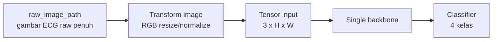
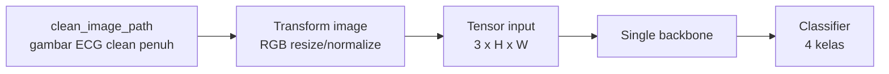
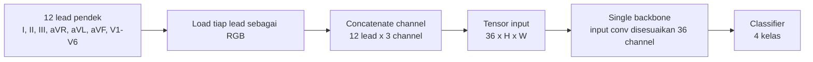
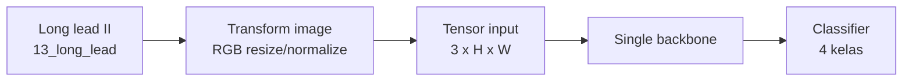
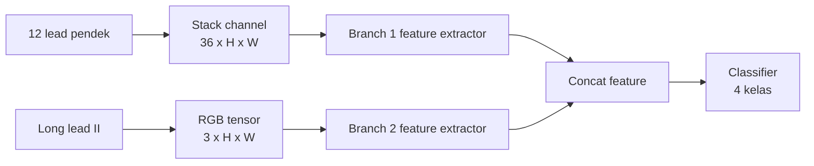
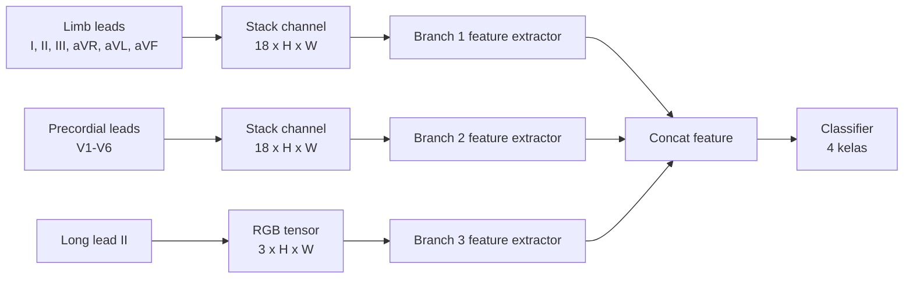
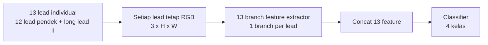
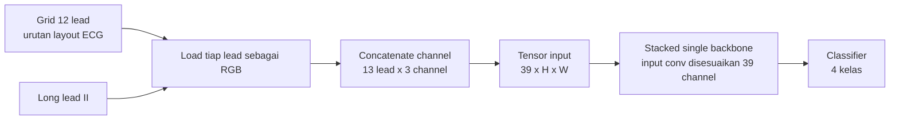
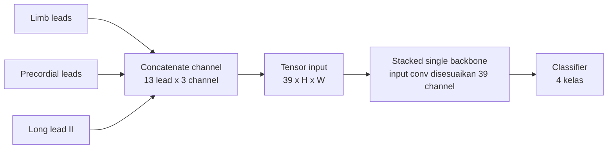
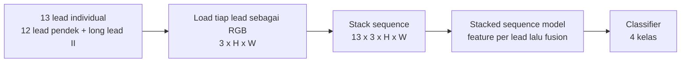

# Penjelasan Perbedaan Skema Input ECG

Dokumen ini menjelaskan perbedaan 10 skema input yang dipakai pipeline `TeluxMMU`. Daftar skema mengikuti wrapper full training di `README.md`, implementasi dataset di `src/data/datasets.py`, dan pemetaan model di `src/models/build_model.py`.

## Ringkasan Cepat

| Skema | Sumber input utama | Bentuk input ke model | Cara pemrosesan | Fokus informasi |
|---|---|---:|---|---|
| `single_raw_image` | Gambar ECG raw penuh | 3 channel | Satu backbone | Tampilan ECG asli sebelum pembersihan |
| `single_clean_image` | Gambar ECG clean penuh | 3 channel | Satu backbone | Tampilan ECG penuh setelah preprocessing |
| `single_12_lead` | 12 lead pendek | 36 channel | Satu backbone | Semua lead standar tanpa long lead |
| `single_long_lead_ii` | Long lead II saja | 3 channel | Satu backbone | Ritme panjang dari lead II |
| `multibranch_12lead_longlead` | 12 lead pendek + long lead | 2 branch: 36 + 3 channel | Feature tiap branch digabung | Morfologi 12 lead dan ritme panjang dipisah |
| `multibranch_6lead_6lead_longlead` | Limb + precordial + long lead | 3 branch: 18 + 18 + 3 channel | Feature tiap branch digabung | Grup anatomi dipisah |
| `multibranch_13lead_individual` | 13 lead individual | 13 branch, masing-masing 3 channel | Feature semua lead digabung | Setiap lead dipelajari terpisah |
| `stacked_12lead_longlead` | 12 lead pendek + long lead | 39 channel | Satu backbone | Semua lead digabung dalam satu tensor |
| `stacked_6lead_6lead_longlead` | Limb + precordial + long lead | 39 channel | Satu backbone | Sama-sama 13 lead, urutan grouping berbeda |
| `stacked_13lead_individual` | 13 lead individual | Sequence 13 x 3 channel | Backbone per lead lalu fusion | Lead tetap individual tetapi memakai jalur stacked sequence |

## Kelompok Lead yang Dipakai

Pipeline membagi lead menjadi beberapa kelompok:

| Kelompok | Isi lead |
|---|---|
| Limb leads | I, II, III, aVR, aVL, aVF |
| Precordial leads | V1, V2, V3, V4, V5, V6 |
| Short 12 leads | Limb leads + precordial leads |
| Long lead | Long lead II |
| All 13 leads | Short 12 leads + long lead II |

Semua gambar lead individual dimuat sebagai RGB, sehingga satu lead menghasilkan tensor 3 channel. Jika beberapa lead digabung dengan `torch.cat`, jumlah channel menjadi `jumlah_lead x 3`.

## Diagram Input ke Model per Skema

### `single_raw_image`

### `single_clean_image`

### `single_12_lead`

### `single_long_lead_ii`

### `multibranch_12lead_longlead`

### `multibranch_6lead_6lead_longlead`

### `multibranch_13lead_individual`

### `stacked_12lead_longlead`

### `stacked_6lead_6lead_longlead`

### `stacked_13lead_individual`

## Detail Tiap Skema

### 1. `single_raw_image`

Skema ini memakai `raw_image_path`, yaitu gambar ECG penuh sebelum versi clean dipilih. Jika raw image tidak tersedia, pipeline fallback ke `clean_image_path`.

Input ke model tetap 3 channel seperti gambar RGB biasa. Karena itu skema ini paling dekat dengan cara model pretrained ImageNet menerima gambar natural: satu gambar masuk ke satu backbone.

Kelebihannya sederhana dan hemat memori. Kekurangannya, model harus belajar sendiri membedakan sinyal ECG, grid, teks, noise, dan elemen visual lain yang mungkin masih ada di gambar raw.

### 2. `single_clean_image`

Skema ini memakai `clean_image_path`, yaitu gambar ECG penuh versi hasil preprocessing. Ini adalah default di `configs/default.yaml`.

Input ke model adalah satu gambar RGB 3 channel. Dibanding raw image, clean image biasanya lebih fokus ke sinyal ECG karena artefak visual yang tidak relevan sudah dikurangi.

Skema ini cocok sebagai baseline utama karena paling stabil, sederhana, dan murah secara memori. Namun, semua lead masih diperlakukan sebagai satu gambar besar, sehingga model tidak diberi struktur eksplisit tentang lead mana yang limb, precordial, atau long lead.

### 3. `single_12_lead`

Skema ini mengambil 12 lead pendek standar: I, II, III, aVR, aVL, aVF, V1, V2, V3, V4, V5, dan V6. Setiap lead RGB 3 channel digabung di dimensi channel, sehingga input menjadi 36 channel.

Model tetap satu backbone, tetapi layer input pertamanya disesuaikan untuk menerima 36 channel. Artinya, semua lead standar masuk bersamaan sebagai satu tensor besar.

Kelebihannya, model melihat semua lead diagnostik standar tanpa long lead. Kekurangannya, pretrained weight pada layer awal tidak lagi identik dengan input RGB biasa karena jumlah channel berubah jauh dari 3 ke 36.

### 4. `single_long_lead_ii`

Skema ini hanya memakai long lead II. Input tetap 3 channel karena sumbernya satu gambar lead RGB.

Long lead II berguna untuk informasi ritme karena durasinya lebih panjang dibanding potongan short lead. Skema ini sengaja mengorbankan informasi spasial 12 lead demi fokus ke pola ritme panjang.

Skema ini cocok sebagai pembanding: apakah klasifikasi penyakit cukup kuat hanya dari lead II panjang, atau membutuhkan distribusi morfologi lintas lead.

### 5. `multibranch_12lead_longlead`

Skema ini memisahkan input menjadi dua branch:

| Branch | Isi | Channel |
|---|---|---:|
| Branch 1 | 12 lead pendek | 36 |
| Branch 2 | Long lead II | 3 |

Masing-masing branch diproses oleh feature extractor, lalu feature digabung sebelum classifier akhir. Pada config default, multibranch memakai shared backbone dengan adapter channel dan projection head per branch.

Tujuannya adalah menjaga perbedaan peran antara 12 lead pendek dan long lead II. Short 12 lead membawa informasi morfologi lintas lokasi, sedangkan long lead membawa informasi ritme panjang.

### 6. `multibranch_6lead_6lead_longlead`

Skema ini memisahkan input menjadi tiga branch:

| Branch | Isi | Channel |
|---|---|---:|
| Branch 1 | Limb leads: I, II, III, aVR, aVL, aVF | 18 |
| Branch 2 | Precordial leads: V1-V6 | 18 |
| Branch 3 | Long lead II | 3 |

Pembagian ini lebih anatomis dibanding `multibranch_12lead_longlead`. Limb leads merepresentasikan sudut frontal, precordial leads merepresentasikan sudut horizontal/dada, dan long lead II merepresentasikan ritme panjang.

Kelebihannya, model diberi struktur yang lebih sesuai dengan cara ECG dibaca secara klinis. Kekurangannya, ada lebih banyak branch dibanding skema single, sehingga komputasi dan fusion lebih kompleks.

### 7. `multibranch_13lead_individual`

Skema ini membuat 13 branch, satu branch untuk setiap lead: 12 lead pendek plus long lead II. Setiap branch menerima gambar RGB 3 channel.

Pendekatan ini memberi pemisahan paling kuat antar lead. Model dapat mengekstrak feature tiap lead secara independen sebelum semuanya digabung pada classifier akhir.

Kelebihannya adalah interpretasi struktur input paling jelas: satu lead sama dengan satu jalur feature. Kekurangannya, jumlah branch banyak, sehingga kebutuhan memori dan waktu training paling berat. Di smoke test repo, skema 13-lead individual juga menjadi salah satu skema yang paling sensitif terhadap batch size pada backbone besar.

### 8. `stacked_12lead_longlead`

Skema ini menggabungkan 12 lead pendek dan long lead II menjadi satu tensor 39 channel. Urutan lead mengikuti layout grid 12 lead lalu ditambah long lead.

Berbeda dari multibranch, semua lead langsung masuk ke satu backbone. Model tidak diberi pemisahan branch antara short lead dan long lead.

Kelebihannya lebih sederhana daripada multibranch karena hanya ada satu jalur model. Kekurangannya, semua hubungan antar lead harus dipelajari dari channel stack besar, dan layer awal backbone harus menerima 39 channel.

### 9. `stacked_6lead_6lead_longlead`

Skema ini juga menghasilkan tensor 39 channel dari 13 lead, tetapi urutannya mengikuti grouping limb leads, precordial leads, lalu long lead II.

Secara jumlah channel, skema ini sama dengan `stacked_12lead_longlead`. Perbedaannya ada pada urutan penyusunan lead di channel stack. Urutan ini dapat berpengaruh karena convolution layer awal membaca channel input sebagai satu set feature yang tetap.

Skema ini berguna untuk menguji apakah urutan/grouping lead yang lebih anatomis memberi sinyal lebih baik dibanding urutan grid 12 lead.

### 10. `stacked_13lead_individual`

Skema ini memuat 13 lead sebagai sequence: setiap lead tetap berupa gambar RGB 3 channel, lalu semua lead disusun menjadi tensor dengan bentuk konseptual `13 x 3 x H x W`.

Di sisi model, skema ini memakai jalur `stacked_sequence`, bukan channel stack 39 biasa. Tujuannya adalah mempertahankan identitas tiap lead saat masuk ke model, tetapi tetap berada dalam keluarga stacked, bukan multibranch eksplisit.

Kelebihannya, informasi tiap lead tidak langsung dilebur menjadi 39 channel datar. Kekurangannya, prosesnya lebih berat daripada single image dan tetap membutuhkan mekanisme fusion antar lead.

## Perbedaan Utama Antar Keluarga Skema

### Single input

Skema single memakai satu input utama dan satu backbone. Contohnya `single_clean_image`, `single_raw_image`, `single_long_lead_ii`, dan `single_12_lead`.

Single 3 channel paling murah dan paling dekat dengan pretrained backbone standar. Single 36 channel tetap sederhana dari sisi arsitektur, tetapi input layer harus menyesuaikan channel yang jauh lebih banyak.

### Multibranch

Skema multibranch membagi lead ke beberapa jalur feature extractor. Feature dari semua branch digabung sebelum classifier.

Keluarga ini cocok ketika struktur klinis lead ingin dipertahankan secara eksplisit. Trade-off utamanya adalah memori, waktu training, dan kompleksitas fusion yang lebih tinggi.

### Stacked

Skema stacked menggabungkan banyak lead ke satu representasi gabungan. Untuk `stacked_12lead_longlead` dan `stacked_6lead_6lead_longlead`, gabungan terjadi di dimensi channel menjadi 39 channel. Untuk `stacked_13lead_individual`, lead dipertahankan sebagai sequence.

Keluarga ini berada di tengah: lebih kaya dari single image penuh, tetapi lebih sederhana daripada multibranch independen.

## Dampak Terhadap Eksperimen

Perbandingan antar skema tidak hanya membandingkan data yang dipakai, tetapi juga cara model melihat struktur ECG:

| Pertanyaan eksperimen | Skema pembanding yang relevan |
|---|---|
| Apakah gambar clean lebih baik dari raw? | `single_clean_image` vs `single_raw_image` |
| Apakah long lead II saja cukup? | `single_long_lead_ii` vs skema 12/13 lead |
| Apakah 12 lead tanpa long lead cukup? | `single_12_lead` vs skema 13 lead |
| Apakah pemisahan branch membantu? | `multibranch_*` vs `stacked_*` |
| Apakah grouping anatomis membantu? | `multibranch_12lead_longlead` vs `multibranch_6lead_6lead_longlead` |
| Apakah tiap lead perlu branch sendiri? | `multibranch_13lead_individual` vs multibranch grouping |
| Apakah urutan channel stack berpengaruh? | `stacked_12lead_longlead` vs `stacked_6lead_6lead_longlead` |

## Catatan Interpretasi Hasil

Jika sebuah skema unggul, penyebabnya belum tentu hanya karena jumlah lead lebih banyak. Faktor lain yang ikut berubah adalah:

- bentuk input ke backbone;
- jumlah channel awal;
- apakah pretrained weight lebih mudah dimanfaatkan;
- apakah struktur lead dipisah atau dilebur;
- kebutuhan memori dan batch size;
- potensi noise dari gambar raw atau lead tertentu.

Karena itu, hasil ranking sebaiknya dibaca bersama `input_scheme`, `model_name`, `batch_size`, `macro_f1`, `balanced_accuracy`, dan confusion matrix. Untuk laporan penelitian, macro F1 dan balanced accuracy lebih informatif daripada accuracy saja jika distribusi kelas tidak seimbang.
