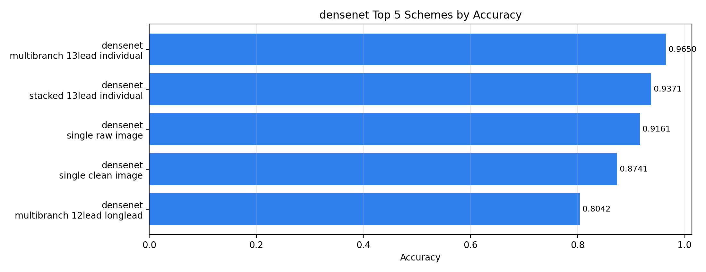
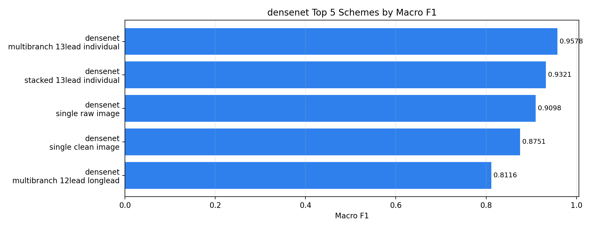

# Run Ranking Summary

Generated at: 2026-06-26T16:52:30
Total completed metric files: 40

## Global Rank by Accuracy

| global_rank_accuracy | model_name | input_scheme | accuracy | macro_f1 | run_dir |
| --- | --- | --- | --- | --- | --- |
| 1 | efficientnet_v2_s | multibranch_13lead_individual | 0.9930 | 0.9917 | runs/efficientnet/20260622_033048_efficientnet_v2_s_multibranch_13lead_individual |
| 2 | densenet201 | multibranch_13lead_individual | 0.9650 | 0.9578 | runs/densenet/20260622_232928_densenet201_multibranch_13lead_individual |
| 3 | mobilenet_v2 | single_clean_image | 0.9510 | 0.9512 | runs/mobilenet/20260621_184656_mobilenet_v2_single_clean_image |
| 4 | efficientnet_v2_s | stacked_13lead_individual | 0.9441 | 0.9389 | runs/efficientnet/20260622_061523_efficientnet_v2_s_stacked_13lead_individual |
| 5 | densenet201 | stacked_13lead_individual | 0.9371 | 0.9321 | runs/densenet/20260626_055149_densenet201_stacked_13lead_individual |
| 6 | mobilenet_v2 | multibranch_13lead_individual | 0.9161 | 0.9170 | runs/mobilenet/20260621_210532_mobilenet_v2_multibranch_13lead_individual |
| 7 | densenet201 | single_raw_image | 0.9161 | 0.9098 | runs/densenet/20260622_192903_densenet201_single_raw_image |
| 8 | mobilenet_v2 | stacked_13lead_individual | 0.9161 | 0.9088 | runs/mobilenet/20260621_231004_mobilenet_v2_stacked_13lead_individual |
| 9 | resnet50 | stacked_13lead_individual | 0.8881 | 0.8909 | runs/resnet/20260622_060902_resnet50_stacked_13lead_individual |
| 10 | resnet50 | single_raw_image | 0.8811 | 0.8771 | runs/resnet/20260622_013326_resnet50_single_raw_image |
| 11 | densenet201 | single_clean_image | 0.8741 | 0.8751 | runs/densenet/20260622_195751_densenet201_single_clean_image |
| 12 | mobilenet_v2 | stacked_12lead_longlead | 0.8392 | 0.8239 | runs/mobilenet/20260621_215443_mobilenet_v2_stacked_12lead_longlead |
| 13 | efficientnet_v2_s | single_raw_image | 0.8322 | 0.8304 | runs/efficientnet/20260622_001937_efficientnet_v2_s_single_raw_image |
| 14 | densenet201 | multibranch_12lead_longlead | 0.8042 | 0.8116 | runs/densenet/20260622_213446_densenet201_multibranch_12lead_longlead |
| 15 | densenet201 | multibranch_6lead_6lead_longlead | 0.8042 | 0.7966 | runs/densenet/20260622_222833_densenet201_multibranch_6lead_6lead_longlead |
| 16 | efficientnet_v2_s | single_clean_image | 0.7902 | 0.7987 | runs/efficientnet/20260622_004141_efficientnet_v2_s_single_clean_image |
| 17 | mobilenet_v2 | single_raw_image | 0.7832 | 0.7779 | runs/mobilenet/20260621_183351_mobilenet_v2_single_raw_image |
| 18 | densenet201 | stacked_6lead_6lead_longlead | 0.7817 | 0.7739 | runs/densenet/20260626_050521_densenet201_stacked_6lead_6lead_longlead |
| 19 | resnet50 | stacked_12lead_longlead | 0.7692 | 0.7429 | runs/resnet/20260622_044727_resnet50_stacked_12lead_longlead |
| 20 | mobilenet_v2 | multibranch_12lead_longlead | 0.7483 | 0.7516 | runs/mobilenet/20260621_195109_mobilenet_v2_multibranch_12lead_longlead |

## Global Rank by Macro F1

| global_rank_macro_f1 | model_name | input_scheme | macro_f1 | accuracy | run_dir |
| --- | --- | --- | --- | --- | --- |
| 1 | efficientnet_v2_s | multibranch_13lead_individual | 0.9917 | 0.9930 | runs/efficientnet/20260622_033048_efficientnet_v2_s_multibranch_13lead_individual |
| 2 | densenet201 | multibranch_13lead_individual | 0.9578 | 0.9650 | runs/densenet/20260622_232928_densenet201_multibranch_13lead_individual |
| 3 | mobilenet_v2 | single_clean_image | 0.9512 | 0.9510 | runs/mobilenet/20260621_184656_mobilenet_v2_single_clean_image |
| 4 | efficientnet_v2_s | stacked_13lead_individual | 0.9389 | 0.9441 | runs/efficientnet/20260622_061523_efficientnet_v2_s_stacked_13lead_individual |
| 5 | densenet201 | stacked_13lead_individual | 0.9321 | 0.9371 | runs/densenet/20260626_055149_densenet201_stacked_13lead_individual |
| 6 | mobilenet_v2 | multibranch_13lead_individual | 0.9170 | 0.9161 | runs/mobilenet/20260621_210532_mobilenet_v2_multibranch_13lead_individual |
| 7 | densenet201 | single_raw_image | 0.9098 | 0.9161 | runs/densenet/20260622_192903_densenet201_single_raw_image |
| 8 | mobilenet_v2 | stacked_13lead_individual | 0.9088 | 0.9161 | runs/mobilenet/20260621_231004_mobilenet_v2_stacked_13lead_individual |
| 9 | resnet50 | stacked_13lead_individual | 0.8909 | 0.8881 | runs/resnet/20260622_060902_resnet50_stacked_13lead_individual |
| 10 | resnet50 | single_raw_image | 0.8771 | 0.8811 | runs/resnet/20260622_013326_resnet50_single_raw_image |
| 11 | densenet201 | single_clean_image | 0.8751 | 0.8741 | runs/densenet/20260622_195751_densenet201_single_clean_image |
| 12 | efficientnet_v2_s | single_raw_image | 0.8304 | 0.8322 | runs/efficientnet/20260622_001937_efficientnet_v2_s_single_raw_image |
| 13 | mobilenet_v2 | stacked_12lead_longlead | 0.8239 | 0.8392 | runs/mobilenet/20260621_215443_mobilenet_v2_stacked_12lead_longlead |
| 14 | densenet201 | multibranch_12lead_longlead | 0.8116 | 0.8042 | runs/densenet/20260622_213446_densenet201_multibranch_12lead_longlead |
| 15 | efficientnet_v2_s | single_clean_image | 0.7987 | 0.7902 | runs/efficientnet/20260622_004141_efficientnet_v2_s_single_clean_image |
| 16 | densenet201 | multibranch_6lead_6lead_longlead | 0.7966 | 0.8042 | runs/densenet/20260622_222833_densenet201_multibranch_6lead_6lead_longlead |
| 17 | mobilenet_v2 | single_raw_image | 0.7779 | 0.7832 | runs/mobilenet/20260621_183351_mobilenet_v2_single_raw_image |
| 18 | densenet201 | stacked_6lead_6lead_longlead | 0.7739 | 0.7817 | runs/densenet/20260626_050521_densenet201_stacked_6lead_6lead_longlead |
| 19 | mobilenet_v2 | multibranch_12lead_longlead | 0.7516 | 0.7483 | runs/mobilenet/20260621_195109_mobilenet_v2_multibranch_12lead_longlead |
| 20 | resnet50 | stacked_12lead_longlead | 0.7429 | 0.7692 | runs/resnet/20260622_044727_resnet50_stacked_12lead_longlead |

## Best per Model

| model_name | num_runs | best_accuracy | best_accuracy_input_scheme | best_macro_f1 | best_macro_f1_input_scheme |
| --- | --- | --- | --- | --- | --- |
| densenet201 | 10 | 0.9650 | multibranch_13lead_individual | 0.9578 | multibranch_13lead_individual |
| efficientnet_v2_s | 10 | 0.9930 | multibranch_13lead_individual | 0.9917 | multibranch_13lead_individual |
| mobilenet_v2 | 10 | 0.9510 | single_clean_image | 0.9512 | single_clean_image |
| resnet50 | 10 | 0.8881 | stacked_13lead_individual | 0.8909 | stacked_13lead_individual |

## Ranking Plots

### Global Top 5 Accuracy

### Global Bottom 5 Accuracy

### Global Top 5 Macro F1

### Global Bottom 5 Macro F1

### Densenet Top 5 Accuracy

### Densenet Top 5 Macro F1

### Efficientnet Top 5 Accuracy

### Efficientnet Top 5 Macro F1

### Mobilenet Top 5 Accuracy

### Mobilenet Top 5 Macro F1

### Resnet Top 5 Accuracy

### Resnet Top 5 Macro F1

## Output Files

- `global_rank.csv`
- `global_rank_by_macro_f1.csv`
- `best_per_model.csv`
- `rank_per_model_accuracy.csv`
- `rank_per_model_macro_f1.csv`
- `plots/global_top_5_accuracy.png`
- `plots/global_bottom_5_accuracy.png`
- `plots/global_top_5_macro_f1.png`
- `plots/global_bottom_5_macro_f1.png`
- `plots/[run_group]_top_5_accuracy.png`
- `plots/[run_group]_top_5_macro_f1.png`
